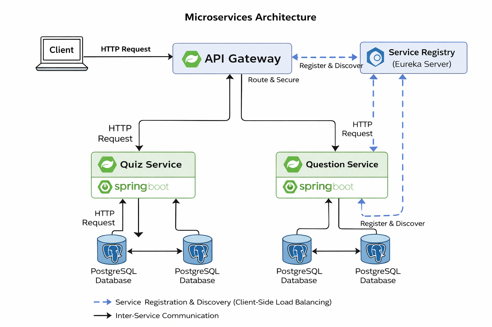

# Quiz Application – Microservices Architecture

This repository contains a **microservices-based Quiz Application** built using **Spring Boot** and **Spring Cloud**.  
The project was initially developed as a **monolithic application** and later **refactored into microservices** to demonstrate scalable backend architecture.

---

## 🧩 Microservices Included

- **Service Registry** – Eureka Server  
- **API Gateway** – Spring Cloud Gateway  
- **Quiz Service** – Manages quizzes and quiz lifecycle  
- **Question Service** – Manages questions and answers  

Each service is independently deployable and follows **database-per-service** principles.

---

## 🏗️ Architecture Diagram

---

## 🔄 Architecture Overview

- Clients communicate only with the **API Gateway**
- **API Gateway** routes requests to internal services
- **Eureka Server** provides service discovery
- **Quiz Service** communicates with **Question Service** using **OpenFeign**
- Each microservice has its **own PostgreSQL database**
- Client-side load balancing is handled automatically

---

## 🔧 Tech Stack

- **Java 17**
- **Spring Boot**
- **Spring Cloud**
  - Eureka Server
  - Spring Cloud Gateway
  - OpenFeign
- **PostgreSQL**
- **Maven**

---

## ▶️ How to Run the Project

Start the services in the following order:

1. **Service Registry (Eureka Server)**
2. **Question Service**
3. **Quiz Service**
4. **API Gateway**

After startup:
- Eureka Dashboard → `http://localhost:8761`
- API Gateway → `http://localhost:8765`

---

## 📌 Key Features

- Microservices architecture
- Service discovery using Eureka
- Centralized routing with API Gateway
- Inter-service communication using OpenFeign
- Independent databases per service
- Load balancing with multiple service instances
- Clean separation of concerns using DTOs

---

## 🚀 Learning Outcome

This project demonstrates:
- Migration from monolithic to microservices architecture
- Real-world microservices communication patterns
- Scalable and maintainable backend system design

---

## 📎 Note

This project is intended for **learning, academic, and interview demonstration purposes** and focuses on architectural concepts rather than production deployment.

---

### 👨‍💻 Author
Vaibhav Malode
